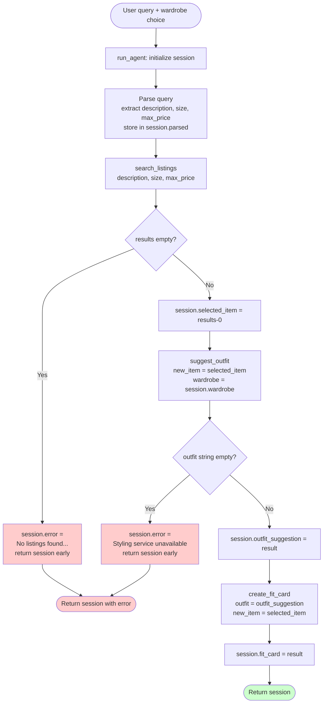

# FitFindr — planning.md

> Complete this document before writing any implementation code.
> Your spec and agent diagram are what you'll use to direct AI tools (Claude, Copilot, etc.) to generate your implementation — the more specific they are, the more useful the generated code will be.
> Your planning.md will be reviewed as part of your submission.
> Update it before starting any stretch features.

---

## Tools

List every tool your agent will use. For each tool, fill in all four fields.
You must have at least 3 tools. The three required tools are listed — add any additional tools below them.

### Tool 1: search_listings

**What it does:**
Searches the mock listings dataset for items that match a natural language description, an optional size, and an optional price ceiling. Size matching is category-aware: the dataset uses different sizing systems depending on item type (letter sizes for tops/outerwear, waist measurements for bottoms, US numeric for shoes, and "One Size" for accessories), so a helper function `_size_matches(listing_size, listing_category, query_size)` normalizes and compares sizes using the appropriate logic for each category. Results are returned sorted by keyword relevance, best match first.

**Input parameters:**
- `description` (str): Natural language keywords describing the desired item (e.g., "vintage graphic tee"). Matched against each listing's `title`, `description`, and `style_tags` fields.
- `size` (str | None): Size string to filter by (e.g., "M", "W30", "8"). Case-insensitive. Matched using category-aware logic (see size matching below). Pass `None` to skip size filtering.
- `max_price` (float | None): Maximum price in dollars, inclusive. Pass `None` to skip price filtering.

**Size matching — `_size_matches(listing_size, listing_category, query_size)`:**

Because the dataset uses incompatible sizing systems across categories, a dedicated helper handles all size comparisons. Both sides are normalized first: parenthetical notes are stripped (`"XL (oversized)"` → `"XL"`), the `"US "` prefix is removed from shoe sizes (`"US 8"` → `"8"`), and everything is lowercased.

The helper then branches by `listing_category`:
- **`tops` / `outerwear` / `accessories`** — slash-range listings (`"S/M"`, `"M/L"`) match if the query equals either half; otherwise exact match after normalization.
- **`bottoms`** — size tokens are split on spaces (`"W30 L30"` → `["W30", "L30"]`); matches if the query equals any token (e.g., `"W30"` matches `"W30 L30"`).
- **`shoes`** — exact match after stripping the `"US "` prefix (e.g., `"8"` matches `"US 8"`).
- **Any category** — listings with `"One Size"` (in any form, including `"One Size / Oversized"` or `"One Size (adjustable)"`) always match regardless of the query size.

**What it returns:**
A `list[dict]`, where each dict is a listing with these fields:
- `id` (str): Unique listing identifier
- `title` (str): Short listing name (e.g., "Faded Nirvana Tee")
- `description` (str): Longer item description
- `category` (str): One of `tops`, `bottoms`, `outerwear`, `shoes`, `accessories`
- `style_tags` (list[str]): Style keywords (e.g., ["vintage", "grunge"])
- `size` (str): Size label (e.g., "M", "S/M")
- `condition` (str): One of `excellent`, `good`, `fair`
- `price` (float): Listing price in USD
- `colors` (list[str]): Color names
- `brand` (str | None): Brand name, or `None` if unlisted
- `platform` (str): One of `depop`, `thredUp`, `poshmark`

Returns `[]` (empty list) if nothing matches — never raises an exception.

**What happens if it fails or returns nothing:**
The agent sets `session["error"]` to: "No listings found for '[description]' under $[max_price]. Try broadening your description or raising your budget." Then it returns the session early — it does NOT call `suggest_outfit` with empty input.

---

### Tool 2: suggest_outfit

**What it does:**
Given a thrifted item the user is considering and their existing wardrobe, generates 1–2 complete outfit suggestions using an LLM. If the wardrobe is empty, returns general styling advice for the item instead of failing.

**Input parameters:**
- `new_item` (dict): A listing dict from `search_listings` — the item the user is considering buying. Must have at minimum `title`, `category`, `style_tags`, and `colors`.
- `wardrobe` (dict): The user's wardrobe with an `items` key containing a list of wardrobe item dicts. Each wardrobe item has `name` (str), `category` (str), `colors` (list[str]), and `style_tags` (list[str]). May be an empty list. The `items` key itself may also be absent (e.g., `{}`); the implementation treats this identically to an empty wardrobe.

> **Implementation note:** The original spec listed the wardrobe item style field as `style` (str). The actual `wardrobe_schema.json` uses `style_tags` (list[str]). The implementation was updated to match the schema — `style_tags` is the correct field name. The wardrobe item's `style_tags` field is not included in the LLM prompt directly; only `name`, `category`, and `colors` are formatted into the prompt. The implementation also uses `wardrobe.get("items", [])` rather than `wardrobe["items"]` so a dict missing the `items` key is handled without raising a `KeyError`. LLM temperature is the Groq default (not explicitly set), consistent with the spec which reserves higher temperature (0.9+) for `create_fit_card` only.

**What it returns:**
A non-empty `str` containing outfit suggestions. When the wardrobe has items, the string names specific wardrobe pieces and how they combine with the new item. When the wardrobe is empty, the string offers general styling advice (what item categories pair well, what aesthetic it fits).

**What happens if it fails or returns nothing:**
If `wardrobe["items"]` is an empty list, the agent does NOT error — it calls `suggest_outfit` normally and the tool handles it by giving general advice. If the LLM call itself raises an exception, the agent sets `session["error"]` to: "Couldn't generate an outfit suggestion — the styling service is unavailable. Try again in a moment." The agent does not proceed to `create_fit_card` with an empty suggestion.

---

### Tool 3: create_fit_card

**What it does:**
Generates a 2–4 sentence Instagram/TikTok-style OOTD caption for a complete outfit based on the outfit suggestion and the thrifted item's details. Uses a higher LLM temperature so each call produces a distinct result.

**Input parameters:**
- `outfit` (str): The outfit suggestion string returned by `suggest_outfit`. Must be a non-empty string.
- `new_item` (dict): The listing dict for the thrifted item. Must have `title` (str), `price` (float), and `platform` (str).

**What it returns:**
A `str` containing a 2–4 sentence caption that:
- Mentions the item name, price, and platform naturally (once each)
- Captures the outfit vibe in specific, non-generic terms
- Sounds casual and authentic (not a product description)
- Varies meaningfully across calls for different inputs

If `outfit` is empty or whitespace-only, returns the error string: "Can't create a fit card — the outfit description is missing. Please try your search again."

**What happens if it fails or returns nothing:**
If `outfit` is empty, the function returns the error string above instead of calling the LLM — no exception is raised. If the LLM call fails, the agent sets `session["error"]` to: "Fit card generation failed. Your outfit suggestion is ready — the caption couldn't be created this time."

> **Implementation note:** The spec states `new_item` must have `title`, `price`, and `platform`. The implementation accesses these via `.get()` with safe fallbacks (`"this piece"`, `""`, `""`) rather than direct key access, so a partially-formed dict does not raise a `KeyError`. LLM temperature is set to exactly `0.9`, the minimum of the spec's `0.9+` range.

---

### Additional Tools (if any)

### Tool 4: compare_price (Stretch Feature)

**What it does:**
Given a listing dict, estimates whether its price is fair by comparing it against other listings of the same category in the dataset. Returns a price assessment with a verdict and reasoning.

**Input parameters:**
- `item` (dict): A listing dict from `search_listings`. Uses `category` (str) and `price` (float) for comparison.

**What it returns:**
A `dict` with:
- `verdict` (str): One of `"great deal"`, `"fair price"`, or `"above average"`
- `median_price` (float): Median price of comparable listings in the same category
- `percentile` (int): Approximate percentile of this item's price within its category (0–100; lower = cheaper)
- `reasoning` (str): 1–2 sentence explanation (e.g., "This $22 top is in the bottom 30% of tops in the dataset, which has a median price of $34.")

Returns `{"verdict": "unknown", "reasoning": "No comparable listings found."}` if no other items share the same category.

**What happens if it fails or returns nothing:**
If `item` is missing `category` or `price`, the agent logs the issue and skips displaying a price verdict. The main workflow continues — price comparison is supplemental and does not block outfit or fit card generation.

---

### Tool 5: get_trends (Stretch Feature)

**What it does:**
Fetches currently trending fashion styles from public online sources and extracts recognized style keywords from post and article titles. The results are passed into `suggest_outfit` so the LLM can weave current trends into its outfit recommendation. Subreddit selection adapts to the user's size — plus-size queries route to plus-size-specific communities. If the primary source (Reddit) is unavailable, the tool falls back to fashion publication RSS feeds automatically.

**Input parameters:**
- `size` (str | None): The size string parsed from the user's query (e.g., `"M"`, `"2X"`). Used to select size-appropriate data sources. Pass `None` to use default sources.
- `category` (str | None): The listing category of the selected item (e.g., `"tops"`). Reserved for future source routing; not currently used for subreddit selection. Pass `None` if unknown.

**Source selection logic:**

Primary source — Reddit public JSON API (no auth required):
```
GET https://www.reddit.com/r/{subreddit}/top.json?t=week&limit=15
User-Agent: python:FitFindr:v1.0 (by /u/FitFindrApp)
```
- Standard sizes (S, M, L, XL, etc.) → `r/femalefashionadvice` + `r/streetwear`
- Plus sizes (1X, 2X, XXL, XXXL, etc.) → `r/PlusSizeFashion` + `r/plussize`

Fallback sources (tried in order if Reddit returns a non-200 or no titles):
1. Who What Wear RSS — `https://www.whowhatwear.com/rss`
2. Refinery29 RSS — `https://www.refinery29.com/en-us/fashion/rss.xml`

**Keyword extraction:**
Post and article titles are scanned against a curated list of recognized style keywords: `cottagecore`, `quiet luxury`, `gorpcore`, `Y2K`, `grunge`, `streetwear`, `preppy`, `boho`, `minimalist`, `dark academia`, `old money`, `coquette`, `barbiecore`, `normcore`, `techwear`, `vintage`, `retro`, and others. Up to 10 matched keywords are returned in the order they appear in the keyword list.

**What it returns:**
A `dict` with:
- `trends` (list[str]): Up to 10 style keywords currently appearing in top posts/articles. Empty list if no keywords were matched or if all sources failed.
- `source` (str): Human-readable label for the data source used (e.g., `"Reddit r/femalefashionadvice + r/streetwear (top posts, past week)"` or `"Who What Wear RSS (latest articles)"`). Set to `"unavailable"` on total failure.
- `error` (str): Present only on failure — describes what went wrong.

**How it influences the outfit suggestion:**
When `trends["trends"]` is non-empty, `suggest_outfit` appends the following to its LLM prompt before calling Groq:
> *Current trending styles this week: [trend1], [trend2], ... Where relevant, weave one of these trends into your outfit suggestion.*

This makes the trend signal visible in the outfit output without overriding the item or wardrobe context.

**What happens if it fails or returns nothing:**
If all sources fail (network error, rate limit, parse error), `get_trends` returns `{"trends": [], "source": "unavailable", "error": "..."}` — it never raises an exception. The agent calls `suggest_outfit` normally without trend context; the interaction completes successfully. Trend awareness is additive and non-blocking.

---

## Planning Loop

**How does your agent decide which tool to call next?**

The planning loop in `run_agent()` works as a sequential conditional chain — each step checks the session state before proceeding:

1. **Initialize**: Call `_new_session(query, wardrobe)` to create the session dict.

2. **Parse query**: Extract `description` (str), `size` (str | None), and `max_price` (float | None) from the raw query string using regex patterns:
   - Price: match `under \$(\d+)` or `\$(\d+)` → `float`
   - Size: match `\bsize\s+([XSML]+\d*)\b` → `str`, else `None`
   - Description: remove price/size fragments; remainder becomes description
   - Store parsed values in `session["parsed"]`.

3. **Search**: Call `search_listings(description, size, max_price)`. Store the result list in `session["search_results"]`.
   - **If `session["search_results"] == []`**: set `session["error"]` to a specific message and `return session` immediately. Do NOT proceed.
   - **If results are non-empty**: set `session["selected_item"] = session["search_results"][0]`.

4. **Suggest outfit**: Call `suggest_outfit(session["selected_item"], session["wardrobe"])`. Store the returned string in `session["outfit_suggestion"]`.
   - **If the returned string is empty**: set `session["error"]` and `return session` early.

5. **Create fit card**: Call `create_fit_card(session["outfit_suggestion"], session["selected_item"])`. Store the result in `session["fit_card"]`.

6. **Return**: Return the completed session dict.

The agent knows it is done when `session["fit_card"]` is populated, or when `session["error"]` is set (early termination). It never calls all three tools unconditionally — each step is gated on the result of the prior step.

---

## State Management

**How does information from one tool get passed to the next?**

All state lives in a single session `dict` created by `_new_session()` at the start of `run_agent()`. No global variables or classes are used.

What is stored and when:

| Key | Type | Set when | Used by |
|-----|------|----------|---------|
| `query` | str | Initialization | Query parser |
| `parsed` | dict | After query parsing | `search_listings` |
| `search_results` | list[dict] | After `search_listings` runs | Planning loop branch check |
| `selected_item` | dict or None | After results confirmed non-empty | `suggest_outfit`, `create_fit_card` |
| `wardrobe` | dict | Initialization (passed in by caller) | `suggest_outfit` |
| `outfit_suggestion` | str or None | After `suggest_outfit` runs | `create_fit_card` |
| `fit_card` | str or None | After `create_fit_card` runs | Returned to UI |
| `error` | str or None | On any early-termination condition | Returned to UI |

How it flows between tools:
- `session["selected_item"]` is the dict returned by `search_listings` — the exact same object is passed as `new_item` to both `suggest_outfit` and `create_fit_card`.
- `session["outfit_suggestion"]` is the string returned by `suggest_outfit` — the exact same string is passed as `outfit` to `create_fit_card`.
- The user never re-enters data between steps. The session dict is the single thread of state across all three tool calls.
- At the end of `run_agent()`, the entire session dict is returned so `handle_query()` in `app.py` can map `selected_item`, `outfit_suggestion`, and `fit_card` to the three Gradio output panels.

---

## Error Handling

For each tool, describe the specific failure mode you're handling and what the agent does in response.

| Tool | Failure mode | Agent response |
|------|-------------|----------------|
| `search_listings` | Returns `[]` — no listings match description/size/price filters | Sets `session["error"]` = "No listings found for '[description]' under $[max_price]. Try broadening your description or raising your budget." Returns session immediately; does not call `suggest_outfit`. |
| `suggest_outfit` | LLM call raises an exception (e.g., API timeout, invalid key) | Sets `session["error"]` = "Couldn't generate an outfit suggestion — the styling service is unavailable. Try again in a moment." Returns session; does not call `create_fit_card`. |
| `create_fit_card` | `outfit` argument is an empty or whitespace-only string | Function returns the error string "Can't create a fit card — the outfit description is missing. Please try your search again." — no exception raised; agent stores the string in `session["fit_card"]` and returns session. |

---

## Architecture



---

## AI Tool Plan

**Milestone 3 — Individual tool implementations:**

For `search_listings`: I'll give Claude the Tool 1 spec block from planning.md (what it does, inputs with types, return value with all field names, failure mode) and the `load_listings()` docstring from `utils/data_loader.py`. I'll ask it to implement the function body in `tools.py` using `load_listings()` — not re-reading the file itself. Before running it, I'll verify the generated code (1) applies all three filters, (2) scores by keyword overlap against `title` + `description` + `style_tags`, (3) returns `[]` without raising on zero results. Then I'll test with 3 queries: one that returns results, one that returns `[]` (impossible query like "designer ballgown XXS under $5"), and one that tests the price ceiling.

For `suggest_outfit`: I'll give Claude the Tool 2 spec block plus the wardrobe schema structure from `data/wardrobe_schema.json`. I'll ask it to implement the function using Groq's `llama-3.3-70b-versatile` model. I'll verify the generated code explicitly branches on `wardrobe["items"] == []` and doesn't crash or return an empty string in that case. I'll test with both `get_example_wardrobe()` and `get_empty_wardrobe()`.

For `create_fit_card`: I'll give Claude the Tool 3 spec block. I'll ask it to guard against an empty `outfit` string before calling the LLM, and to use a higher temperature (0.9+). I'll verify the guard clause exists and returns an error string (not raises). I'll run it 3 times on the same input and confirm the outputs vary.

**Milestone 4 — Planning loop and state management:**

I'll give Claude the Planning Loop section, State Management section, and the Architecture diagram from planning.md, plus the existing `_new_session()` and `run_agent()` stub from `agent.py`. I'll ask it to implement `run_agent()` following the exact conditional chain in the Planning Loop section — branching on empty `search_results` before calling `suggest_outfit`, and on an empty `outfit_suggestion` before calling `create_fit_card`. Before running it, I'll verify the generated code (1) has an early return when `search_results == []`, (2) stores values into session using the exact key names from `_new_session()`, (3) does NOT call all three tools unconditionally. I'll test the happy path with the example query from the walkthrough, and the no-results path with "designer ballgown size XXS under $5" — confirming `session["fit_card"]` is `None` and `session["error"]` is set in the second case.

---

## A Complete Interaction (Step by Step)

**Example user query:** "I'm looking for a vintage graphic tee under $30. I mostly wear baggy jeans and chunky sneakers. What's out there and how would I style it?"

**Step 1: Query parsing + search_listings**

The agent extracts description="vintage graphic tee", size=None, max_price=30.0 from the query. Since session["selected_item"] is None, the planning loop calls search_listings(...). It returns [{"name": "Faded Nirvana Tee", "price": 22.0, ...}, ...]. The agent picks the top result and stores it in session["selected_item"].

(Non-happy path: If the list is empty, the agent sets session["error"] and stops, telling the user: "No listings matched... try broadening your description or raising your budget.")


**Step 2: suggest_outfit**

Since session["selected_item"] is populated and session["outfit_suggestion"] is None, the planning loop calls suggest_outfit(new_item=<stored tee>, wardrobe=<user wardrobe>). Returns a styling suggestion string, stored in session["outfit_suggestion"].

**Step 3: create_fit_card**

Since session["outfit_suggestion"] is populated and session["fit_card"] is None, the planning loop calls create_fit_card(outfit=<stored suggestion>, new_item=<stored tee>). Returns the caption string, stored in session["fit_card"].

**Final output to user:**

All three session values returned to the UI. The user sees the Gradio interface populate its three specific output panels with the final session state data.

Search Result Panel: Displays the selected item details, showing the "Faded Nirvana Tee" along with its price ($22.00) and condition.

Styling Advice Panel: Displays the natural language response from the suggest_outfit tool, specifically advising the user on how to style the vintage tee with their preferred baggy jeans and chunky sneakers.

Fit Card Panel: Displays the final generated Instagram-style caption from the create_fit_card tool, ready for the user to copy and share.